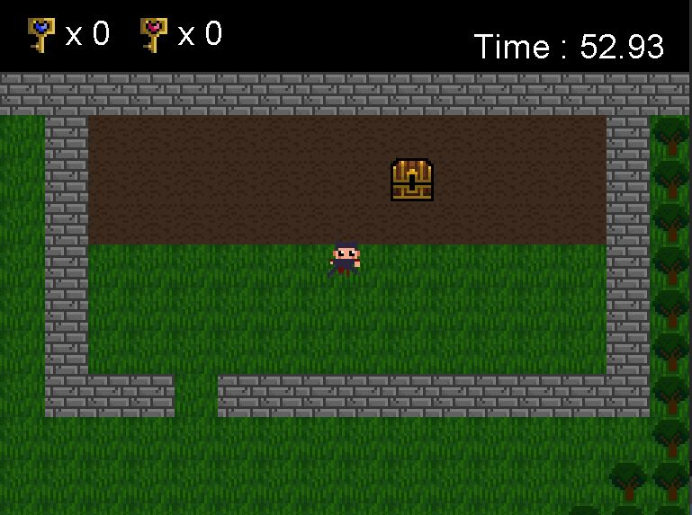

# Welcome to My GitHub Page! 🎮📱

Hello and welcome! I'm excited to have you visit my GitHub page. 
I'm a budding software engineer with a passion for creating games and apps that bring joy and solve 
real-world problems. 
While I may not have years of experience under my belt, I'm eager to learn, grow, and make a positive 
impact in the world of software development.

## Exploring Game Development 🎮 
I'm diving headfirst into the world of game development and loving every minute of it! From simple 
2D games to more complex 3D adventures, 
I'm on a journey to learn the ropes and craft immersive experiences. 
While I may still be honing my skills, I'm enthusiastic about pushing boundaries and exploring new ideas 
in game design. Through my 
background in Concept art and Game design, I had the chance to explore different software, IDE and game 
engines such as Unreal and Unity/ Godot.

## Venturing into App Development 📱 
In addition to games, I'm also delving into the realm of app development. Whether it's creating apps to 
streamline tasks, boost productivity, or entertain users, I'm eager to apply my coding knowledge to develop practical solutions. 
Every project is a chance for me to learn something new and contribute to making people's lives a little easier.

## Seeking Opportunities to Grow 🔍
As I continue my coding journey, I'm on the lookout for opportunities to collaborate, learn, and grow. 
While I may be a newcomer to the field, I'm dedicated to honing my craft and making meaningful contributions. 
If you're an employer looking for a passionate and eager software engineer who's ready to dive in and make a 
difference, I'd love to connect with you!

## Tools I'm Learning 🔧 
I'm currently building my toolkit with various technologies and languages, including:

* Programming Languages: Python, Java, JavaScript, C#, C++
* Game Engines: Unity, Unreal, Godot
* Mobile Development: Flutter
* Web Development: HTML/CSS, SQL
* Version Control: Git, GitHub

**I additionally have knowledge of Graphic design & 3D Modelling tools such as:**
* Photoshop
* Procreate
* Illustrator
* Zbrush
* Maya
* Nomad

**Thank you for taking the time to visit my page, and I look forward to connecting with you soon!**

Happy coding! 🚀✨

### _Stef_

